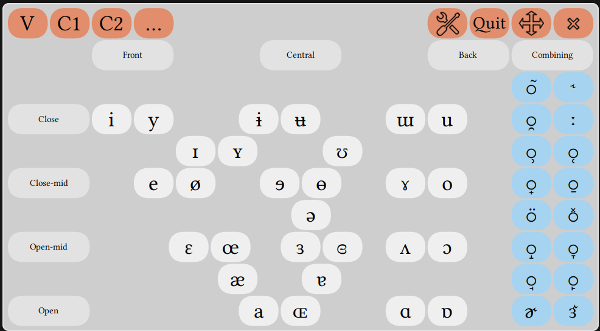

This is an International Phonetic Alphabet Layout setup for the [Onboard](https://launchpad.net/onboard) virtual keyboard. It contains a keyboard layout and a theme.

This is still a stub. It has three functionnal panels (Vowels, Consonants 1 and 2) which will be completed by one panel for additional symbols.

# Install

Copy the contents of both folders respectively into :

    ~/.local/share/onboard/layouts/

and

    ~/.local/share/onboard/themes/

