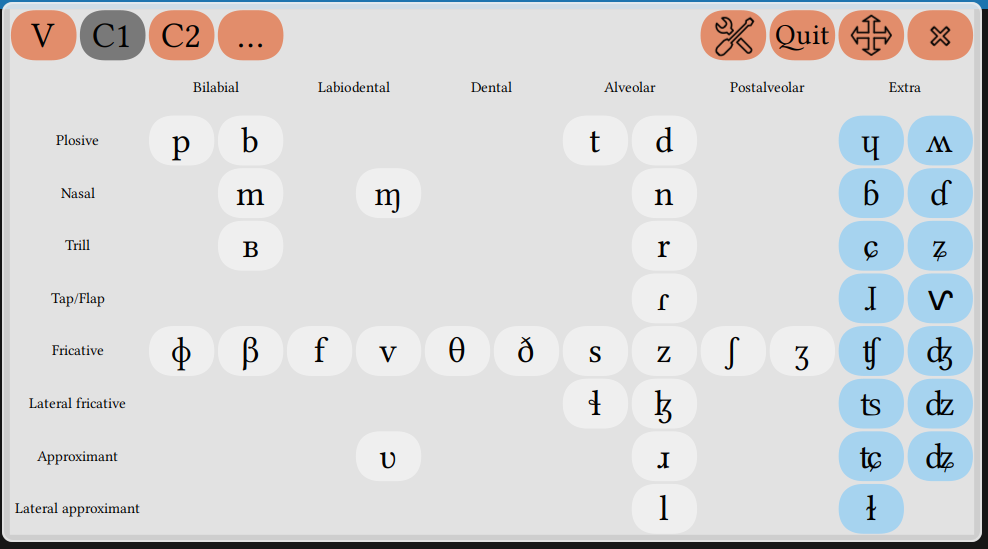

This is a solution for linguists who wish to type unicode [IPA](https://www.internationalphoneticassociation.org/sites/default/files/IPA_Deja_2015.pdf) on linux systems.
*Ce dépot est une solution pour les linguistes qui souhaitent saisir des symboles unicodes de l'API sur des systèmes linux.*

It is an alternative to [web based unicode IPA keyboards](http://linguistlist.org/unicode/ipa.html).

The repository holds an International Phonetic Alphabet Layout setup for the [Onboard](https://launchpad.net/onboard) virtual keyboard. It contains a keyboard layout and a theme, designed to go together.

The keyboard has four panels (Vowels, Consonants 1 and 2, others), and is currently in beta version.

# Install

Copy the contents of both folders layouts/ and themes/ respectively into :

    ~/.local/share/onboard/layouts/

and

    ~/.local/share/onboard/themes/

Then launch onboard

    onboard

Go to the preferences : `Preferences > Layout` and select `IPA`. Then go to `Preferences > Theme` and also select `IPA`

# Usage

Launch onboard. The keyboard appears on top of your windows. Click on the keyboard to insert the character. Change panels by clicking "V", "C1", "C2" or "...".

For some latin letters, holding a key offers variants (some of which might already be in the keyboard):

To use with LaTeX, you need unicode to be handled, so you should use [xelatex](https://en.wikipedia.org/wiki/XeTeX) rather than pdflatex. Wether on LaTeX or on a [conventional text editor](https://www.libreoffice.org/download/libreoffice-fresh/), you also need to use a font which has good unicode coverage of the IPA. I use the [Linux Libertine](http://www.linuxlibertine.org/index.php?id=1&L=1) family, but it is not the only one and the [international phonetics association](https://www.internationalphoneticassociation.org) recommends the [DejaVu Sans](http://dejavu-fonts.org/wiki/Main_Page) font.