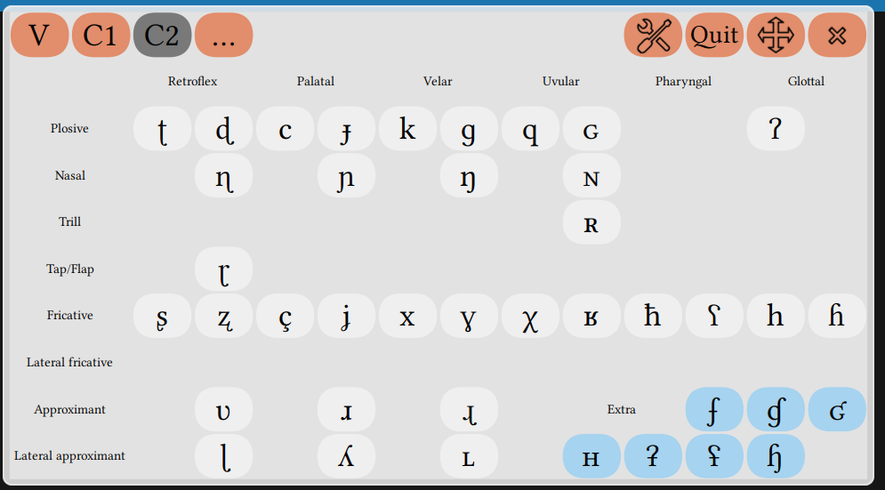
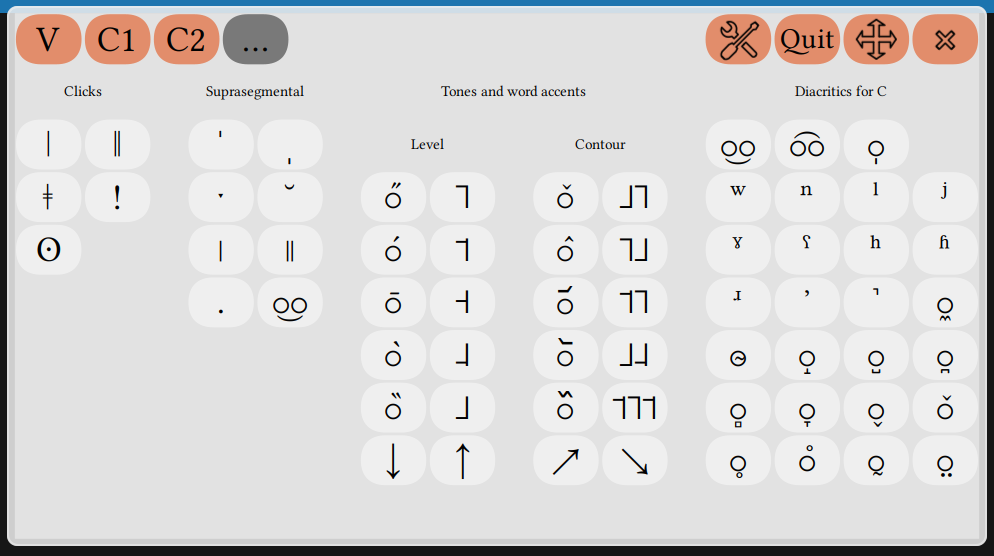

This is a solution for linguists who wish to type unicode [IPA](https://www.internationalphoneticassociation.org/sites/default/files/IPA_Deja_2015.pdf) via a virtual keyboard.

*Ce dépot est une solution pour les linguistes qui souhaitent saisir des symboles unicodes de l'API avec un clavier virtuel.*

It is an alternative to [web based unicode IPA keyboards](http://linguistlist.org/unicode/ipa.html).

The repository holds an International Phonetic Alphabet Layout setup for the [Onboard](https://launchpad.net/onboard) virtual keyboard. It contains two keyboard layouts (standard and compact) and a theme, designed to go together. Below is the standard layout and theme :

The keyboard has four panels (Vowels, Consonants 1 and 2, others), and is currently in beta version.
The compact layout is less faithful to the phonetic table in terms of placement of the keys, but keys appear bigger for the same keyboard size.

# Install

## Installing onboard

Onboard is present in the Ubuntu repository. For latest versions, you could also [use the launchpad ppa](https://launchpad.net/~onboard/+archive/ubuntu/stable). I have tested the layout for versions 1.0 and 1.2.

## Installing the layout

Copy the contents of both folders layouts/ and themes/ respectively into :

    ~/.local/share/onboard/layouts/

and

    ~/.local/share/onboard/themes/

Then launch onboard via your application menu or by typing:

    onboard

Launch onboard preferences by launching onboard then going to `Preferences > Layout`, or by typing `onboard-settings` in a terminal. Select `IPA` or `IPA (compact)`. Then go to `Preferences > Theme` and also select `IPA`.

# Usage

Launch onboard. The keyboard appears on top of your windows. Click on the keyboard to insert the character. Change panels by clicking "V", "C1", "C2" or "...".

For some latin letters, holding a key offers variants (some of which might already be in the keyboard):

To use with LaTeX, you need unicode to be handled, so you should use [xelatex](https://en.wikipedia.org/wiki/XeTeX) rather than pdflatex. Wether on LaTeX or on a [conventional text editor](https://www.libreoffice.org/download/libreoffice-fresh/), you also need to use a font which has good unicode coverage of the IPA. I use the [Linux Libertine](http://www.linuxlibertine.org/index.php?id=1&L=1) family, but it is not the only one and the [international phonetics association](https://www.internationalphoneticassociation.org) recommends the [DejaVu Sans](http://dejavu-fonts.org/wiki/Main_Page) font.